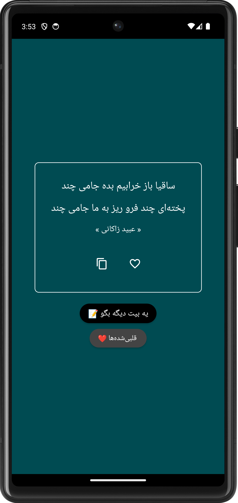
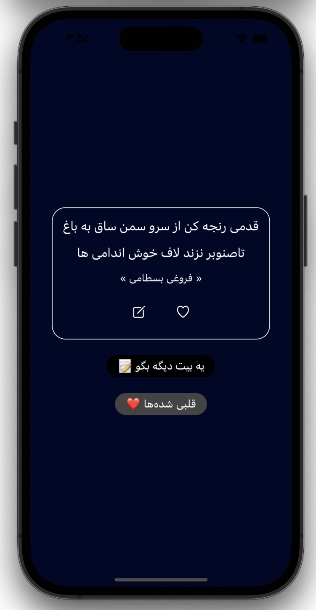
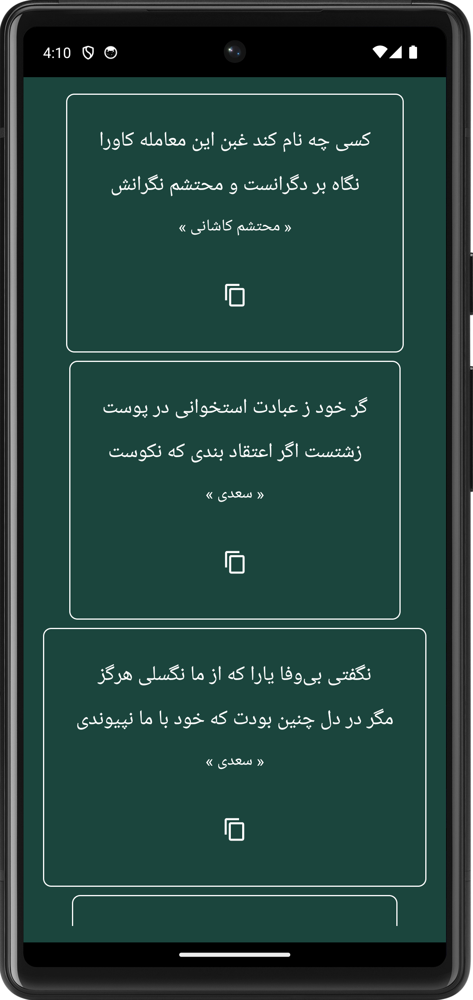

# KorsiSher 📜

KorsiSher brings the enchanting world of Persian poetry right to your fingertips. Dive into a vast collection of random Persian poems, save your favorites, and share them with the world. Crafted meticulously with modern technologies for both Android and iOS platforms.

## Features ✨

- **Discover Random Poems**: Stumble upon beautiful Persian poems from various poets every time you launch the app.
- **Favorites**: Found a poem that resonates with your soul? Save it to your favorites for easy access.
- **Sharing**: Share the beauty of Persian poetry with your friends and family with just a click.

## Challenges & Solutions 🧠

Building KorsiSher was not only about delivering Persian poetry to users but also navigating through various technical challenges:

1. **Dependency Injection Across Platforms**:
  - **Android**: Used Hilt for DI, maximizing its seamless integration and scalability.
  - **iOS**: Crafted a pattern to mirror Hilt's functionality in iOS, ensuring consistent DI across platforms.

2. **Database Management**:
  - **Android**: Employed Room for a robust SQLite object mapping experience.
  - **iOS**: Integrated SqlDelight, facilitating smooth database interactions and shared SQL code.

3. **Unified Business Logic**:
  - Aiming to share as much business logic as possible, including ViewModels. With Android ViewModel offering distinct advantages, adapting this logic to iOS posed challenges and required thoughtful solutions.

4. **Kotlin Asynchrony & iOS**:
  - Kotlin's Flow and Coroutine are go-to tools for asynchronous tasks on Android. To utilize these on iOS, we designed custom wrappers ensuring smooth asynchronous operations on both platforms.

5. **Cross-platform Networking with Ktor**:
  - Implementing Ktor for networking was a significant step in maintaining consistent data interactions between Android and iOS. It required a deep understanding and adjustments to address platform-specific nuances.

## Built With 🛠️

- **Kotlin Multiplatform**: Shared business logic across Android and iOS, ensuring consistent behavior and minimized code duplication.
- **Android**:
  - Jetpack Compose for a contemporary UI.
  - Hilt for dependency injection.
  - Clean Architecture for a structured, maintainable framework.
- **iOS**:
  - SwiftUI for a native and fluid UI experience.

## Screenshots 📱

| Android Main Screen | iOS Main Screen | Favorites Screen |
|--------------------|-------------------|------------------|
|  |  |  |

## Installation 📥

### Android:

1. Download from Play Store [PlayStore](https://play.google.com/store/apps/details?id=korsi.sher.android&hl=en&gl=US).

### iOS:

1. Coming Soon...

## Contribution 🤝

Contributions from the community are always welcome. Be it a bug fix, feature enhancement, or documentation update, we value your input! Dive into our [Contribution Guide](link_to_contributing.md) to get started.

## License 📄

This project is under the MIT License. Refer to the [LICENSE.md](link_to_license.md) file for more details.

## Acknowledgments 🙏

- To the poets who've enriched our world with their beautiful words.
- Special tnx to [Ganjoor](https://ganjoor.net/) for random poem API.